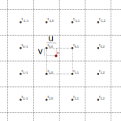

---
export_on_save:
 html: true
---

[TOC]

# 纹理过滤与优化
## 过滤模式
### 最邻近插值
每个像素读取最近的纹素，会导致呈现出的图像像素化，优点是消耗少
### 双线性插值

如图，与像素p相邻的4个纹素分别为t00, t01, t10, t11, p相对于t00的偏移量为(u,v)。
定义线性插值法
$$
lerp(f,a,b)=a+f*(b-a)
$$
则
$$
\begin{aligned}
Color_p&=lerp(v,Color_{t0},Color_{t1})\\ 
&=lerp(v,lerp(u,t00,t01),lerp(u,t10,t11))
\end{aligned}
$$
所以双线性插值实际上进行了3次插值运算。
### 双三次(Bicubic)插值

#### 三次插值
先来考虑一个简单的情况：
1. 对与函数 $f(x)=a+bx+cx^2+dx^3$，已知 $f(0)$，$f(1)$，$f'(0)$，$f'(1)$，求 $f(0.5)$
    $$
    \begin{aligned}
        f’(x) &= b+2cx+3dx^2 \\
        f(0) &= a \\
        f(1) &= a+b+c+d \\
        f'(0) &= b \\
        f'(1) &= b+2c+3d \\
        \therefore a&=f(0) \\
        b&=f'(0) \\
        c&= -3f(0)+3f(1)-2f'(0)-f'(1) \\
        d&=2f(0)-2f(1)+f'(0)+f'(1)
    \end{aligned}
    $$
    求出了方程各项系数，只需要将 $0.5$ 代入即可求得$f(0.5)$。
2. 对与函数 $f(x)=a+bx+cx^2+dx^3$，已知 $f(-1)$，$f(0)$，$f(1)$，$f(2))$，求 $f(0.5)$
   与1相比，此处不知道插值点相邻2点函数值的导数，但是知道相邻4个点的函数值，记
    $$
    \begin{aligned}
        f(-1) &= p0 \\
        f(0) &= p1 \\
        f(1) &= p2 \\
        f(2) &= p3 \\
    \end{aligned}
    $$
    则可用相邻2点处的斜率代替导数，即
    $$
        \begin{aligned}
            f'(0) &= \frac{p2-p0}{2} \\
            f'(0) &= \frac{p3-p1}{2} \\
        \end{aligned}
    $$
    然后可以再次利用1的方法求 $f(0.5)$。
3. 对与函数 $f(x)=a+bx+cx^2+dx^3$，已知 $f(0)=p1$，$f(1)=p2$，求 $f(0.5)$
   与2相比，此时只知道相邻2点的值，我们可用以下方法假定 $f(-1)$ 与 $f(2)$：
   
   - 重复 $f(0)$ 与 $f(1)$ 的值，即
        $$
            \begin{aligned}
                f(-1)&=f(0)&=p1\\
            f(2)&=f(1)&=p2
            \end{aligned}
        $$
   - 令 $f(-1)$ 与 $f(2)$ 在 $f(0)$ 与 $f(1)$ 的延长线上，即
        $$
            \begin{aligned}
                f(-1)&=2p1-p2\\
            f(2)&=2p2-p1
            \end{aligned}
        $$
    然后可以再次利用2和1的方法求 $f(0.5)$。
#### 双三次插值
了解了一维函数的三次插值之后再来看二维函数的三次插值，实际上就是在两个维度上各进行一次三次插值。
图像 $ A $ 放大 $ k $ 倍后为图像 $ B $ ，有
$$
P_B(x_b,y_b)=kP_A=(kx_a,ky_a)
$$
所以对 $ B $ 中任一点 $(x_b,y_b)$ 可以求出其在 $ A $ 上的对应点为 $(\frac{1}{k}x_b,\frac{1}{k}y_b)$。

如上图所示，假设 $ p $ 为 $ B $ 上某一像素点 $P_b$ 在 $ A $ 中对应的像素点的位置，其中 $t_{0,0}\text{\textasciitilde} t_{1,1}$ 是与 $ p $ 最邻近的像素点，则 $P_B$ 的颜色值为 $t_{-1,-1} \text{\textasciitilde} t_{2,2} $ 这16个像素颜色的加权平均值。
记插值函数为
$$
    g(x,y) = \sum_{i=0}^3\sum^{3}_{j=0}a_{ij}x^{i}y^{j}
$$
则其导数为
$$
    \begin{aligned}
        g_x(x,y)&=\sum_{i=1}^3\sum^{3}_{j=0}ia_{ij}x^{i-1}y^{j} \\
        g_y(x,y)&=\sum_{i=0}^3\sum^{3}_{j=1}ja_{ij}x^{i}y^{j-1} \\
        g_{xy}(x,y)&=\sum_{i=1}^3\sum^{3}_{j=1}ija_{ij}x^{i-1}y^{j-1} \\
    \end{aligned}
$$
则有如下方程组：
$$
\begin{aligned}
    g(0,0)&=a_{00} \\
    g(0,1)&=a_{00}+a_{01}+a_{02}+a_{03} \\
    g(1,0)&=a_{00}+a_{10}+a_{20}+a_{30} \\
    g(1,1)&=\sum_{i=0}^3\sum^{3}_{j=0}a_{ij} \\
    g_x(0,0)&=a_{10} \\
    g_x(0,1)&=a_{10}+a_{11}+a_{12}+a_{13} \\
    g_x(1,0)&=a_{10}+2a_{20}+3a_{30} \\
    g_x(1,1)&=\sum_{i=1}^3\sum^{3}_{j=0}ia_{ij} \\
    g_y(0,0)&=a_{01} \\
    g_y(0,1)&=a_{01}+a_{11}+a_{21}+a_{31} \\
    g_y(1,0)&=a_{01}+2a_{02}+3a_{03} \\
    g_y(1,1)&=\sum_{i=0}^3\sum^{3}_{j=1}ja_{ij} \\
    g_{xy}(0,0)&=a_{11} \\
    g_{xy}(0,1)&=a_{11}+2a_{12}+3a_{13} \\
    g_{xy}(1,0)&=a_{11}+2a_{21}+3a_{31} \\
    g_{xy}(1,1)&=\sum_{i=1}^3\sum^{3}_{j=1}ija_{ij} \\
\end{aligned}
$$
记
$$
    \begin{aligned}
        \vec{\alpha} &= [a_{ij}]^T \;\;\;\;i,j=0,1,2,3; \\
        \vec{x} &= [g(x,y),g_x(x,y),g_y(x,y),g_{xy}(x,y)]^T \;\;\;\;x,y=0,1 \\
    \end{aligned} 
$$
则上述方程组可表示为
$$
    \begin{aligned}
        A\vec{\alpha}&=\vec{x} \\
        \therefore \vec{\alpha }&=A^{-1}\vec{x}
    \end{aligned} 
$$
其中

由此便可得出插值函数。

#### 双三次卷积
上述方法需要求一个16维矩阵的的逆矩阵来获得插值函数，应用中可以通过在两个维度上卷积来近似求解，三次卷积核函数满足以下条件：
　　1. 对于三次卷积插值，$W(0)=1$，$W(n)=0, n\not ={0}$
　　2. 卷积核必须是对称函数
　　3. 该函数必须连续且一阶导数连续
记
$$
    W(x)=\begin{cases}
        a_1+b_1|x|+c_1|x|^{2}+d_1|x|^3 &|x|\leq 1 \\
        a_2+b_2|x|+c_2|x|^{2}+d_2|x|^3 &1<|x|\leq 2 \\
        0 &|x|>2
    \end{cases}
$$
则将 $x=0,1,2$ 带入 $W(x)$ 和 $W'(x)$ ,假设 $W'(1)=a (a<0)$ 可得
$$
    \begin{aligned}
        a_1&=1 \\
        a_1+b_1+c_1+d_1=a_2+b_2+c_2+d_2&=0 \\
        a_2+2b_2+4c_2+8d_2&=0 \\
        b_1&=0 \\
        b_1+2c_1+3d_1=b_2+2c_2+3d_2&=a \\
        b_2+4c_2+12d_2&=0 \\
    \end{aligned}
$$
解上述方程组可得
$$
    W(x)=\begin{cases}
        1-(a+3)|x|^{2}+(a+2)|x|^3 &|x|\leq 1 \\
        -4a+8a|x|-5a|x|^2+a|x|^3 &1<|x|<2 \\
        0 &otherwise
    \end{cases}
$$
$a=-\frac{1}{2}$ 时，$W(x)$对原始函数的采样间隔产生三阶收敛(见[论文](../reference/Cubic%20convolution%20interpolation%20for%20digital%20image%20processing.pdf)),
设 $t\in(0,1)$，则 $(2-t)\in(-2,-1)$，$(1-t)\in(-1,0)$，$(t+1)\in(1,2)$，代入 $W(x)$ 得：
$$
    \begin{aligned}
        W(t+1)&= \frac{1}{2} (-t^3+2t^2-t) \\
        W(t)&= \frac{1}{2} (3t^3-5t^2+2) \\
        W(t-1)&= \frac{1}{2} (3t^3+4t^2+t) \\
        W(t-2)&= \frac{1}{2} (t^3-t^2)
    \end{aligned}
$$
所以对一维原始序列 $[f_{-1} \  f_0 \  f_1 \  f_2 ]^T$ 在 $t$ 处的插值可以表示为
$$
    I(t,f_{-1},f_0,f_1,f_2)= 
    \frac{1}{2} 
    \begin{bmatrix}
        1 & t & t^2 & t^3 \\
    \end{bmatrix}
    \begin{bmatrix}
        0 & 2 & 0 & 0 \\
        -1 & 0 & 1 & 0 \\
        2 & -5 & 4 & -1 \\
        -1 & 3 & 3 & 1 \\
    \end{bmatrix}
    \begin{bmatrix}
        f_{-1} \\
        f_0 \\
        f_1 \\
        f_2 \\
    \end{bmatrix}
$$
所以 $p(u,v)$ 处的插值为
$$
    \begin{aligned}
        I(&v,\\
    &I(u,f_{-1,-1},f_{-1,0},f_{-1,1},f_{-1,2}), \\
    &I(u,f_{0,-1},f_{0,0},f_{0,1},f_{0,2}), \\
    &I(u,f_{1,-1},f_{1,0},f_{1,1},f_{1,2}), \\
    &I(u,f_{2,-1},f_{2,0},f_{2,1},f_{2,2})
    )
    \end{aligned}
$$

### 光滑曲线插值
原理同双线性插值，双线性插值的插值曲线为
$$
    I(x) = \frac{f_{x_2}-f_{x_1}}{x_2-x_1}x+x_1
$$
光滑曲线则是
$$
    \begin{aligned}
        I(x')& = \frac{f_{x_2}-f_{x_1}}{x_2-x_1}x'+x_1 \\
        x'&=x^2(3-2x) \\ 
        or& \\
        x'&=x^3(6x^{2}-15x+10)
    \end{aligned}
$$

## 优化方式
### Mipmap
生成方式：计算一定区域内颜色的平均值

解决问题：摩尔纹，锯齿
导致问题：远处贴图模糊，丢失大量细节

### 各向异性过滤
- ripmap
实现方式：将贴图沿纵横方向压缩储存

解决问题：部分贴图模糊
遗留问题：当一个像素斜向覆盖多个纹素时依然会有模糊

- 积分图
生成方式：
记点 $(x,y)$ 处的颜色值为 $i(x,y)$，则积分图中点 $(x,y)$ 处的值为
$$
    I(x,y) = \sum_{u=0,v=0}^{u=x,v=y}i(u,v)
$$
可递归表示为
$$
    I(x,y) = i(x,y)+I(x-1,y)+I(x,y-1)-I(x-1,y-1)
$$
查询：

矩形 $ABCD$ 区域内的纹素值
$$
    \sum_{x_A<x<x_D,y_A<y<y_D}i(x,y)=I_D+I_A-I_B-I_C
$$
